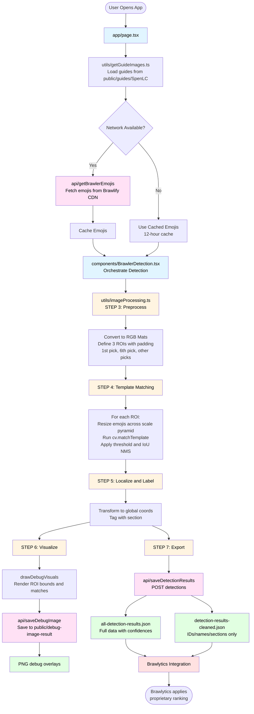
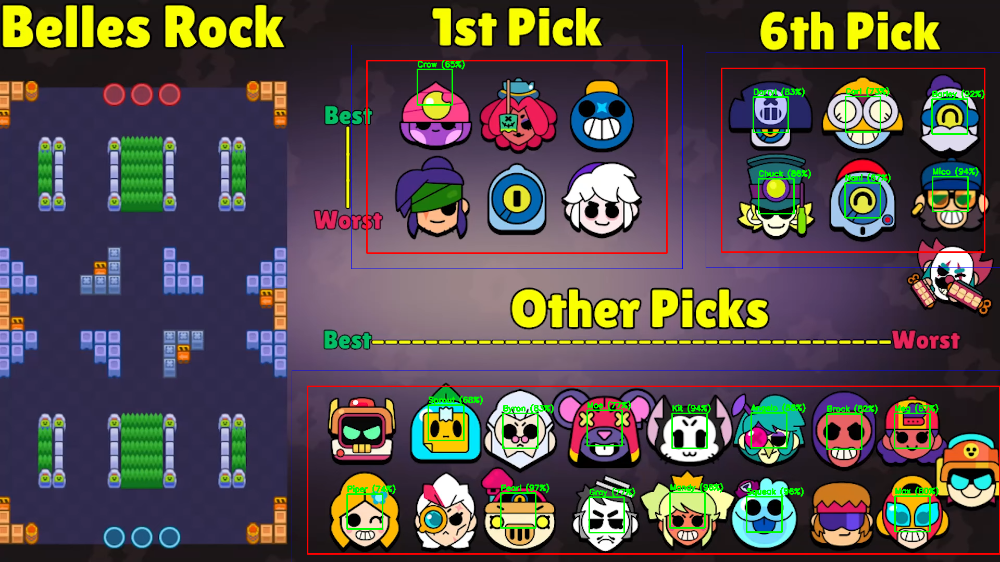
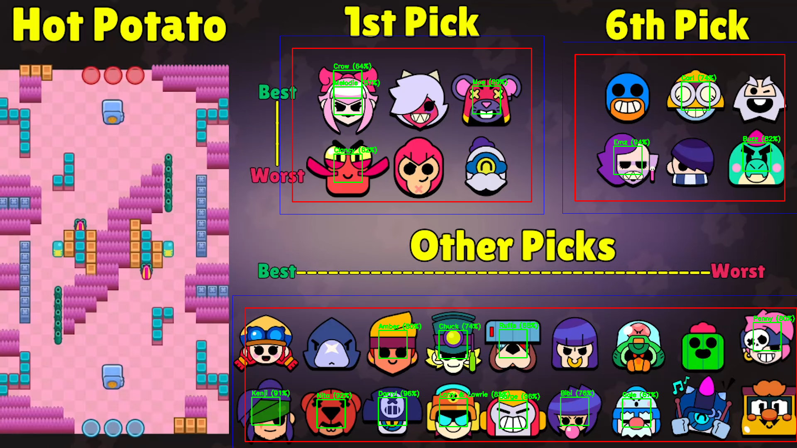
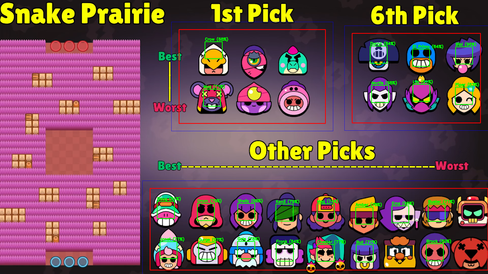

Brawl Stars SpenLC Template-Matching Detector
============================================

This tool ingests SpenLC draft-guide images, runs a computer-vision pipeline (OpenCV template matching) to recover every recommended brawler, and emits both JSON and visual overlays. The outputs feed Brawlytics so its proprietary ranking algorithm can layer SpenLC’s picks into your filtered recommendations.

Why it exists
-------------
- Brawlytics (https://brawlytics.app) needs structured brawler picks per map when users filter to “SpenLC”. This tool automates turning 24 guide images into machine-readable data instead of hand-labeling them.
- Once the detections are in JSON, Brawlytics applies its scoring/ranking logic on top of SpenLC’s curated picks to surface the best choices per map.

Process timeline (data flow)
----------------------------
1) Guide intake: `app/page.tsx` pulls every file in `public/guides/SpenLC` using `utils/getGuideImages.ts`.
2) Emoji fetch + cache: `/api/getBrawlerEmojis` downloads each brawler emoji (e.g. ) from Brawlify CDN and caches for 12 hours to avoid repeated network hits.
3) Preprocess: `utils/imageProcessing.ts` converts guide and emoji PNGs to RGB Mats, defines three ROIs (1st pick, 6th pick, other picks) with padding, and estimates template scales from ROI geometry.
4) Match: per ROI, it resizes each emoji across a small scale pyramid, runs `cv.matchTemplate`, thresholds, and filters overlaps using IoU to keep the highest-confidence, non-duplicated hits.
5) Localize + label: surviving matches are transformed back to global coordinates and tagged with their section.
6) Visualize: `drawDebugVisuals` renders boxes for ROI bounds (original + padded) and each match, then `/api/saveDebugImage` persists the overlay to `public/debug-image-result`.
7) Export: `components/BrawlerDetection.tsx` POSTs detections to `/api/saveDetectionResults`, which appends to `detection-results/all-detection-results.json` (full data) and `detection-results/detection-results-cleaned.json` (ids/names/sections).

Mermaid Flow Diagram
-----------------------


Computer-vision details
-----------------------
- Template source: emoji sprites from Brawlify CDN (example above) are decoded to Mats; each sprite is matched independently.
- Scale search: scales are derived from ROI dimensions to match expected icon size, reducing brute-force search while handling moderate size variance.
- Thresholding: matches below a tuned normalized cross-correlation score are dropped; section-specific multipliers favor stricter matches on smaller ROIs.
- Non-maximum suppression: overlaps are pruned with an IoU-based filter and a “seen brawler” set so the same brawler is kept once at its best confidence.
- ROI padding: ROIs are expanded slightly to avoid edge misses, then coordinates are reprojected back to the original image space for consistent JSON and overlay rendering.

Artifacts
---------
- JSON: `detection-results/all-detection-results.json` (full confidences/coordinates) and `detection-results/detection-results-cleaned.json` (compact).
- Debug overlays: `public/debug-image-result/*-debug.png` showing section bounds and template hits.

Included debug samples
----------------------




Run it yourself
---------------
```bash
npm install
npm run dev
# open http://localhost:3000
```

Usage notes
-----------
- Drop or replace guide images in `public/guides/SpenLC` (PNG/JPG/GIF); they auto-load on refresh.
- Network is needed on the first run to download emojis; cached afterward.
- Outputs accumulate; clear `detection-results/` or `public/debug-image-result/` for a fresh pass.

Key files
---------
- `components/BrawlerDetection.tsx` — orchestrates detection flow, progress UI, saving results.
- `utils/imageProcessing.ts` — OpenCV preprocessing, ROI definitions, template matching, debug rendering.
- `app/api/getBrawlerEmojis/route.ts` — fetches and caches Brawlify emoji sprites.
- `app/api/saveDebugImage/route.ts` — persists overlay PNGs to `public/debug-image-result`.
- `app/api/saveDetectionResults/route.ts` — appends run outputs to JSON artifacts.
